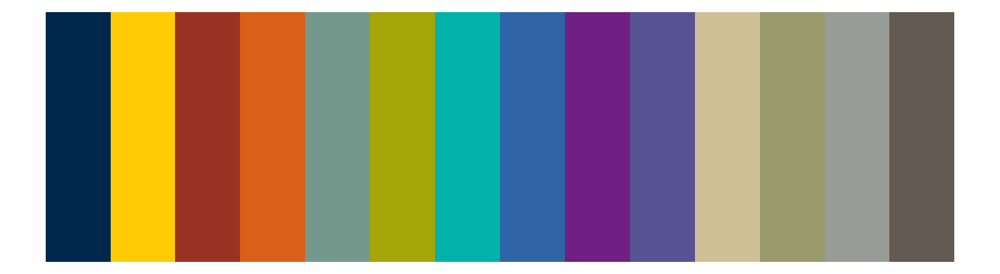
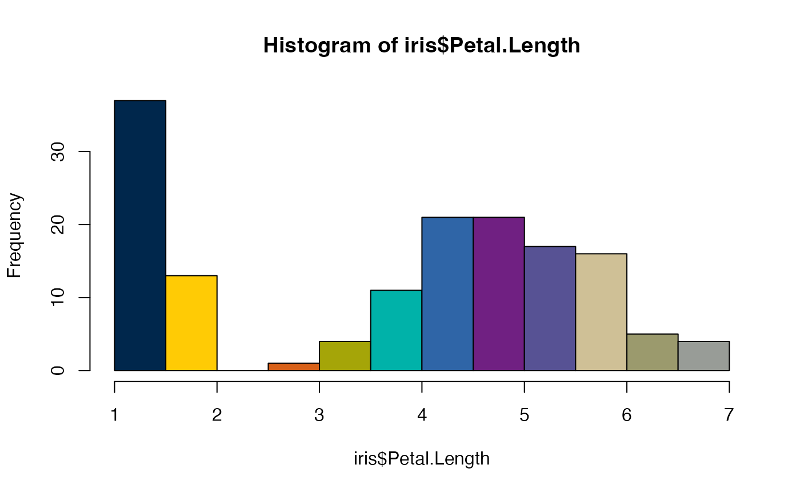
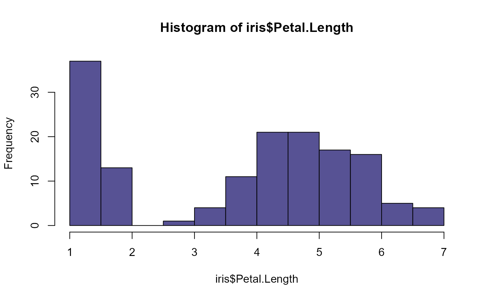
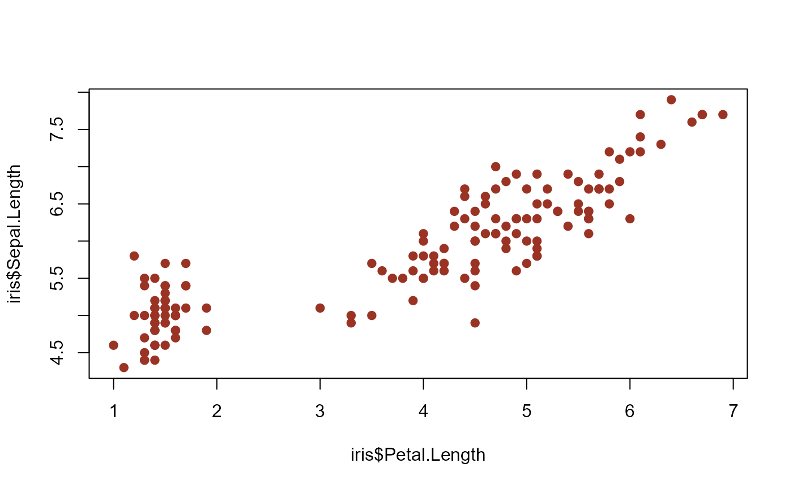
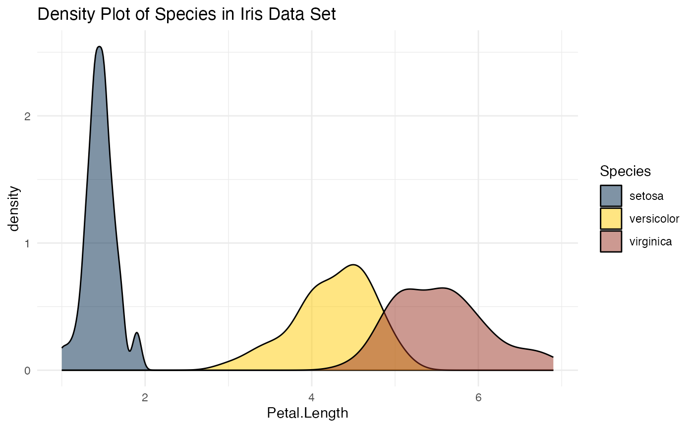
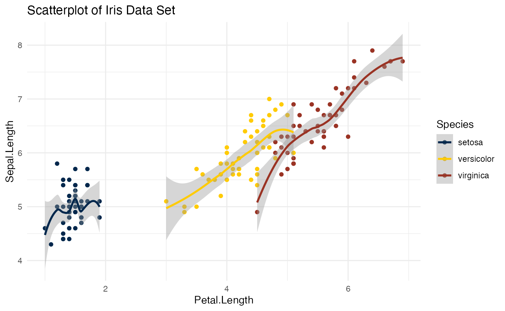
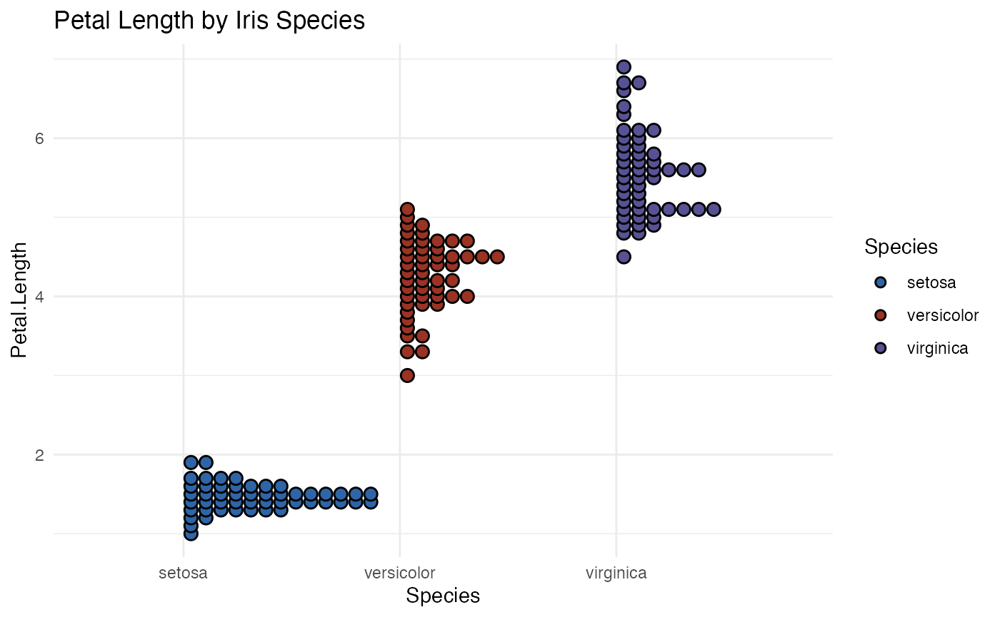

# Basic Use



## Installation

You will need to install `devtools` if you have not already done so:

``` r

install.packages("devtools")
```

Then use `devtools` to install `michigancolors`.

``` r

devtools::install_github("agrogan1/michigancolors")
```

## Usage

``` r

library(michigancolors)
```

## Allowable Colors

Colors are drawn from
<https://brand.umich.edu/design-resources/colors/>.

Allowable colors are: “blue”, “maize”, “tappan red”, “ross school
orange”, “rackham green”, “wave field green”, “taubman teal”, “arboretum
blue”, “ann arbor amethyst”, “matthaei violet”, “umma tan”, “burton
tower beige”, “angell hall ash”, and “law quad stone”

## Help

``` r

help(michigancolors)
```

## Examples

### Base R

#### Entire Palette Of Colors

``` r

hist(iris$Petal.Length, col = michigancolors())
```



``` r

hist(iris$Petal.Length, 
     col = michigancolors(),
     main = "Petal Length of Iris Flowers",
     xlab = "Petal Length")
```


#### Specific Color

``` r

hist(iris$Petal.Length, col = michigancolors("matthaei violet"))
```



``` r

plot(iris$Petal.Length, 
     iris$Sepal.Length, 
     pch = 19,
     col = michigancolors("tappan red"))
```



### ggplot2

``` r

library(ggplot2)
```

#### Entire Palette Of Colors

``` r

ggplot(iris, 
       aes(x = Petal.Length, 
           fill = Species)) + 
  geom_density(alpha = .5) + 
  labs(title = "Density Plot of Species in Iris Data Set") + 
  theme_minimal() + 
  scale_fill_manual(values = michigancolors())
```



``` r

ggplot(iris, 
       aes(x = Petal.Length, 
           y = Sepal.Length, 
           color = Species)) + 
  geom_point() + 
  geom_smooth() + 
  labs(title = "Scatterplot of Iris Data Set") + 
  theme_minimal() + 
  scale_color_manual(values = michigancolors())
#> `geom_smooth()` using method = 'loess' and formula = 'y ~ x'
```



#### Specific Colors

``` r

library(ggdist) # distribution plots

ggplot(iris,
       aes(x = Species,
           y = Petal.Length,
           fill = Species)) +
  geom_dots(dotsize = 3, # dot size
            color = "black") + # outline color
  labs(title = "Petal Length by Iris Species") + 
  theme_minimal() + 
  scale_fill_manual(values = c(michigancolors("arboretum blue"),
                               michigancolors("tappan red"),
                               michigancolors("matthaei violet")))
```


